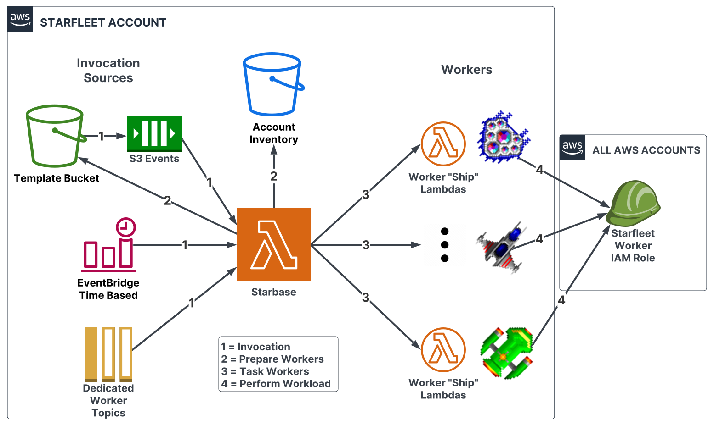

# Starfleet Architecture Overview
This page discusses the components in the Starfleet architecture and what they do.

## Note: Many components are still in progress of being implemented

## Diagram

## General Gist
The general gist is as follows:

* There is 1 AWS account that houses all the Starfleet components
* Lambda functions (called worker "ships") execute tasks in your environment with a payload that provides context on what to do
* An IAM role exists in all your AWS accounts that the worker "ship" Lambda functions can assume so it can operate in the AWS account in question
* The Lambda functions are tasked by a component called the `Starbase` - this generates the payload and tasks the worker ship to execute
* An AWS account index/inventory exists to inform the `Starbase` on which accounts need to be tasked
* Serverless and idempotent; highly parallelized

## Components

1. *Worker Ship Lambdas* - These are Lambda functions that go out and actually perform the desired workload. Worker ship Lambdas are tasked from an SQS queue with the payload describing the workload to be performed in the account (or account/region) in question. The Starbase generates the payload for the given worker ship and places it in the worker's SQS queue. Each worker ship also has a unique configuration that can be set.
1. *Payload Template YAML files* - These are the YAML templates that will be provided to the worker ships to describe what an infrastructure state should look like. The worker is supposed to use the template to know what actions to be performed in the target destination.
1. *Starbase* - This is a Lambda function that tasks workers for jobs to run.
1. *Payload Template S3 Bucket* - This is an S3 bucket that holds the payload template YAMLs. This bucket is configured to have notifications (to be implemented) that invoke the Starbase. The Starbase is then able to task the desired worker ship with the template payload to execute. The event system allows for CI/CD.
1. *AWS Account Index* - This is an index or inventory of all AWS accounts that Starfleet should operate on. By default, Starfleet ships with a worker ship that automatically generates a JSON file based on AWS Organizations. This JSON file is used by the Starbase to know which accounts exist and when to task the worker ships.
1. *EventBridge Time Based events* - The Starbase can be invoked with EventBridge timed events. This allows for CRON-like invocation of workers. Worker ships can be configured to get invoked on a time schedule.
1. *Resident IAM role* - This is an IAM role that exists in all AWS accounts that Starfleet operates in. This role (or roles) allows the Starfleet worker ships to assume into a destination account and then operate within it. Starfleet uses a hub-spoke type of model (octopus) to perform tasks in your infrastructure. *Note: Starfleet is a security sensitive application and as such should reside in a limited-access AWS account!*
1. *Dedicated worker SQS queues* - Not yet implemented - these are SQS queues (or topics?) that will be used to directly invoke a worker ship through the Starbase.

## Next Sections
The next sections go into detail about what each component does and why.
