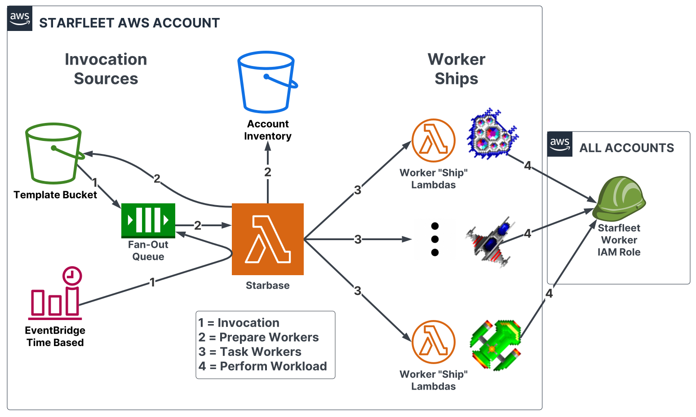

# Welcome to ✨Starfleet✨
Welcome to the [Starfleet](https://github.com/gemini-oss/starfleet) project! Starfleet is a totally awesome whole-AWS infrastructure automation tool built off of AWS Lambda and Python.

Starfleet is a tool that runs automation against an entire AWS infrastructure. The primary goal is to address gaps that exist with AWS Organizations.

This works by running Lambda functions to operate in the context of an AWS account. Starfleet consists of worker "ships" that receive a templated payload
to implement a desired infrastructure state. The "ship" will perform the actions necessary to ensure that the infrastructure state conforms to the template.
Think of this like an IaC but for an entire AWS infrastructure. This allows you to place properly configured infrastructure resources where you need them.

Starfleet's primary audience are cloud infrastructure and security engineers that have a need to support medium to large and growing AWS infrastructures.

## Why use Starfleet?
We designed Starfleet to address the infrastructure needs of multi-account AWS users. In multi-account environments there is a need to configure cloud infrastructure that spans
the entirety of the cloud footprint. In some cases, some accounts need to have differently configured resources than other accounts. Sometimes this is needed at a regional level too.

Cloud infrastructure and security engineers need a place where they can easily design and implement features in a manner that is:

1. Easy to understand; human readable
1. Located in one convenient place
1. Flexible to the address the realities of medium to large and diverse AWS infrastructures
1. Infrastructure defined as code (IaC)
1. Detects AND prevents drift for incorrectly configured components
1. First-class understanding of multi-account and multi-regional workloads (or some combination thereof)
1. Dynamically and automatically operate across your AWS infrastructure as new accounts get provisioned and deleted

A lot of existing tools come close for implementing some of these features, but don't quite meet the mark unless a lot of tooling is developed to address the shortcomings.

### Clear and Simple Templates
Starfleet relies on simple, easy to read YAML templates that provide worker Lambda functions with the context required to operate across an AWS infrastructure. The design of these templates
follows the following philosophy:

1. Control structures like loops and if statements belong in code, not templates
1. There is a time and place for Jinja; just not all of the times in all of the places

The worker ships do all the heavy lifting so that templates are easy to read and parse. Easily readable templates provide context faster and reduce the likelihood of errors.
This is especially important when operating at scale. We believe complexity should happen in the code; not N times in templates (the concept of _Don't Repeat Yourself_, only for real).

At the end of the day, Starfleet is what you make of it. It provides the platform for running AWS account-aware Lambda functions that can operate anywhere in your infrastructure.

## Architecture Overview
For more information please review the [Architecture](architecture/Overview.md) page for how this all works, but below is a sample diagram of the architecture:

