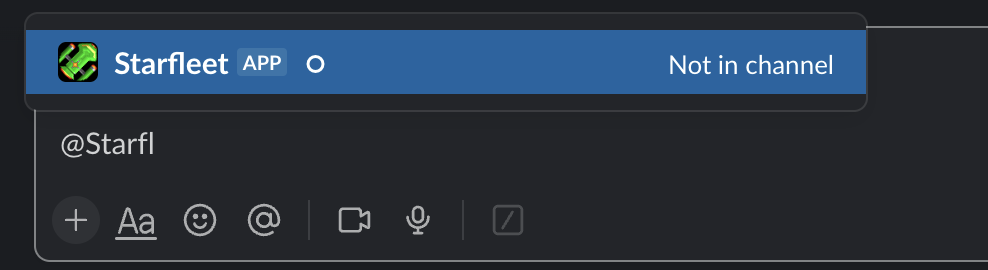

# Slack Alerts

Starfleet supports emitting alerts and notifications in Slack. This requires that you:

1. Set up a Slack application and configure it for your workspace
2. Get a Slack token
3. Configure the [Secrets Manager](Secrets.md) for Starfleet and store the Slack token in the secret
4. Invite the Slack app to the Slack channels that you want the alerts sent to
5. Update the worker configurations to include the Slack channel ID and desired alert priority
6. Deploy the updated worker

## Create a Slack Application
For this section, you will want to largely rely on [Slack's documentation for registering a Slack Bot](https://api.slack.com/authentication/basics), configuring the proper permissions, and obtaining a Slack token. However

!!! warning
    The Slack instructions and screenshots below are from June 2023 and could be outdated in the future. Please consider submitting a Pull Request to update if that happens!

1. The general gist is you will go to [`api.slack.com/apps`](https://api.slack.com/apps), sign into your Slack account, and you will create an app:<br />
1. You will want to select `From scratch`
1. On the next window, type in the app name of `Starfleet` and select the Slack workspace you want to install it in<br />

Once your app is created, you may need to have a Slack administrator approve the application for it to be installed in the workspace and usable. If that is the case, you will still be able to update the configuration while your app is being approved.

## Configure the Slack Application
Once the app is created, you can begin configuring it and getting a token.

!!! tip
    Before moving forward, make sure that you have the Secrets Manager secret made. If you don't yet have one, then you will want to create one in the AWS console.

1. You will need to go to the `OAuth & Permissions` page:<br />
1. Scroll down to Scopes. You will need to add the following OAuth scopes:
    1. `channels:read`
    1. `chat:write`<br />
1. You will need to prepare the JSON for Secrets Manager. The `SlackToken` needs to reside under the `STARFLEET` section of the secret JSON string. Open an empty text editor with the following text:
    ```json
    {
        "STARFLEET": {
            "SlackToken": "COPY THE SLACK TOKEN HERE"
        }
    }
    ```
    ^^ This assumes that you haven't yet created a secret. If you already have a secret, then fetch that out of Secrets Manager, copy it to your text editor, and modify it with the Slack token added into it.

    The Slack token is found when scrolling up under the `OAuth Tokens for Your Workspace` section:<br />

    Copy and paste the updated secret text into Secrets Manager's UI and save the updated secret string.

1. Once this is all done, make any additional tweaks you want, like updating the Slack icon and description

## Invite to Your Channels
Once your app has been approved into the workspace, then the next step is to invite the newly created app to your Slack channels. In this example we named it `Starfleet`, so we can go to the Slack channels that we want Starfleet to announce alerts in and invite it by sending the message `@Starfleet`. As you are typing that in, you should see it pop up in the autocompletion box:<br />

Follow the prompts to invite it to the channel. Once it's in the channel, Starfleet is able to announce messages there!

## Adjust Configurations
The last step is to make updates the Starfleet configuration to both enable Slack and also configure the workers to announce messages to the desired channels.

### Enable Slack
You need to enable Slack in the `STARFLEET` section of the configuration by adding both the `SecretsManager` configuration and also the `SlackEnabled` flag set to `True`. Here is an example:

```yaml
STARFLEET:
  # ... all the the other stuff ...
  SecretsManager:
    SecretId: Starfleet                  # Or whatever you named your Secret
    SecretRegion: SECRET-REGION-HERE     # Replace with the region of the secret
  SlackEnabled: True
```

### Configure the Worker
Once Slack is enabled in the main `STARFLEET` stanza, you also need to update your worker's `AlertConfiguration` section with details on the Slack channel ID and the desired message priority you want to emit messages on (`ChannelId` and the `AlertPriority`).

* **`AlertConfiguration`** - This is an encompassing dictionary that specifies a Slack channel ID and a message priority for sending alerts to Slack from that worker. This is documented more in the Developer and User guides around Notifications.
    * **`ChannelId`** - This is the Slack Channel ID that messages should be sent to
    * **`AlertPriority`** - This is the `AlertPriority` enum string (documented in the Developer guide). Acceptable values are: `NONE`, `PROBLEM`, `IMPORTANT`, `SUCCESS`, and `INFORMATIONAL`.

For more details on how the message priority logic works, see this section in the [Developer Guide](../developerGuide/primaryComponents/Notifications.md#message-priority).

The Slack channel ID is obtained by right-clicking on your Slack channel name, then clicking on `View channel details`. Scroll all the way to the bottom, and you will see `Channel ID` and a copy button after the ID to copy it. Click that and copy that to your worker configuration.<br />

Your worker configuration should look like:
```yaml
WorkerName:
  # ... all the other stuff ...
  AlertConfiguration:  # <--- Send messages to Slack
    ChannelId: PASTE-CHANNEL-ID-HERE
    AlertPriority: INFORMATIONAL  # Replace with the other acceptable values specified above
```

#### Example Configuration
An example of a wrapped up configuration with everything all set up looks like this with the `AwsConfigWorkerShip` as an example:
```yaml
STARFLEET:
  DeploymentRegion: REGION
  TemplateBucket: BUCKET-HERE
  FanOutQueueUrl: https://sqs.REGION.amazonaws.com/ACCOUNT-HERE/starbase-fanout-queue
  AccountIndex: StarfleetDefaultAccountIndex
  LogLevel: DEBUG
  SecretsManager:
    SecretId: Starfleet
    SecretRegion: REGION
  SlackEnabled: True
  ThirdPartyLoggerLevels:
    botocore: CRITICAL
    'urllib3.connectionpool': CRITICAL

# ... more stuff ...

AwsConfigWorkerShip:
  Enabled: True
  TemplatePrefix: AwsConfigWorkerShip/
  InvocationQueueUrl: https://sqs.REGION.amazonaws.com/ACCOUNT-HERE/starfleet-aws-config-worker
  InvocationSources:
    - EVENTBRIDGE_TIMED_EVENT
    - S3
  EventBridgeTimedFrequency: SIX_HOURLY
  WorkerRoleToAssume: starfleet-worker-role
  AlertConfiguration:
    ChannelId: CHANNEL-ID-HERE
    AlertPriority: INFORMATIONAL
```

At this point, Slack notifications should be all set.
